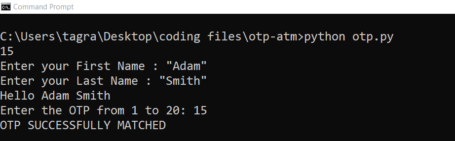
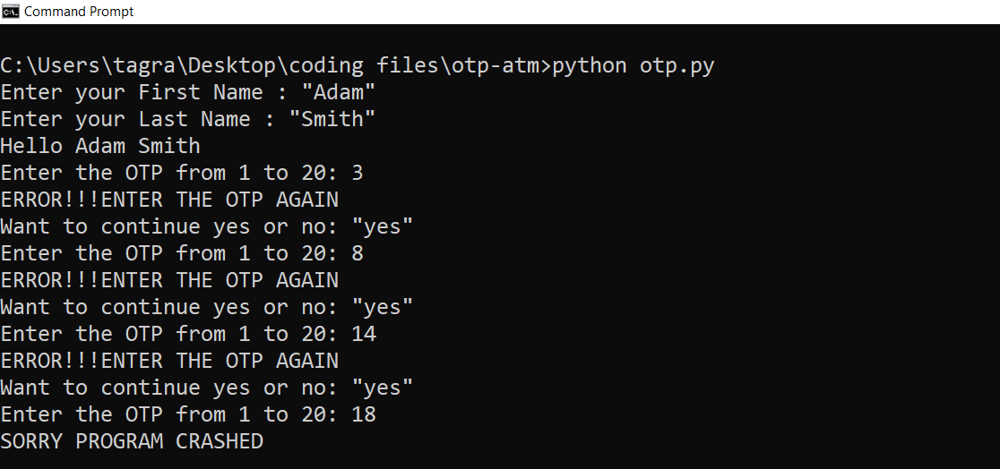

# otp-atm
## OTP | ATM Functions- using fundamentals concepts

### Instructions

1. Used random library to generate random number

2. Number entered by user in range 1 to 20.

3. If user input is equal to random number.

4. If user input is not equal to random number.

